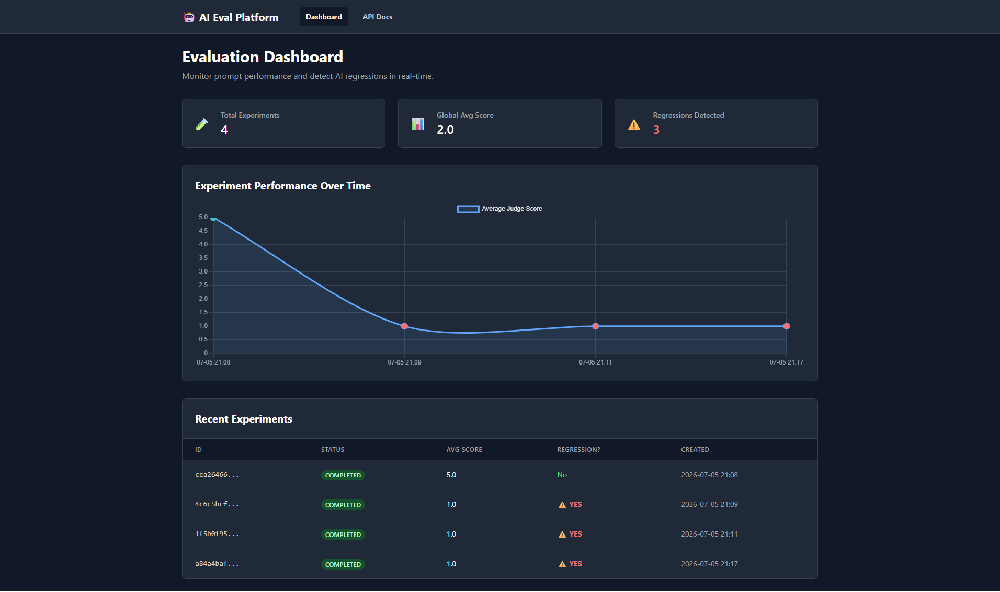
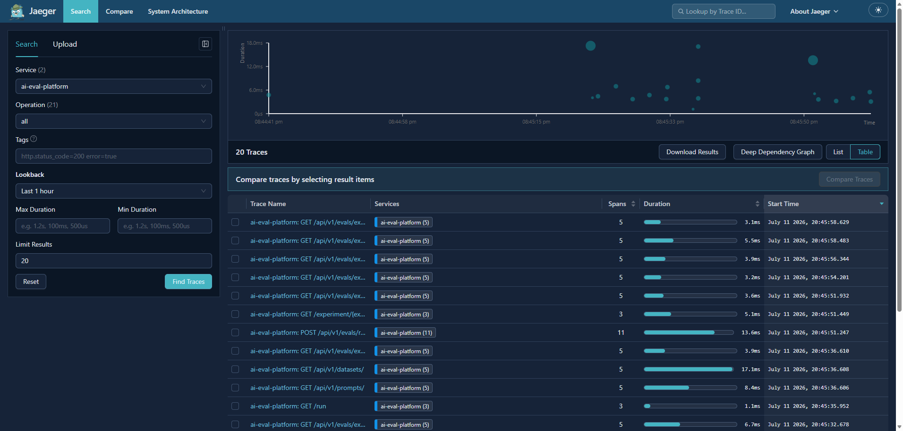
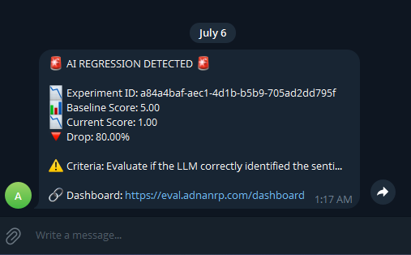

# 🛡️ Enterprise AI Evaluation & LLMOps Platform


A production-grade, distributed SaaS platform acting as a CI/CD pipeline for LLMs. It automates the testing of prompts against Golden Datasets, detects mathematical regressions, tracks LLM token costs via JSONB telemetry, and provides end-to-end distributed tracing for AI workloads.

🌐 **Live Demo:** [eval.adnanrp.com](https://eval.adnanrp.com/dashboard) | 🔭 **Observability:** [eval-jaeger.adnanrp.com](https://eval-jaeger.adnanrp.com)

---

## 🌟 Key Features

- **🔄 Distributed Task Queue:** Replaced synchronous background tasks with a **Celery + Redis** architecture. The FastAPI API acts purely as a Producer, while separate, horizontally scalable Celery Workers consume the queue and execute heavy LLM evaluations.
- **🗄️ Postgres + JSONB Telemetry:** Migrated from SQLite to PostgreSQL. Leverages native **JSONB** columns to store unstructured LLM telemetry (token usage, latency, raw payloads), enabling highly performant, indexable analytical queries on AI operational costs.
- **🛡️ Anti-Sycophancy LLM-as-a-Judge:** Engineered a specialized evaluation prompt utilizing **Context Isolation** to grade *business accuracy* rather than *instruction-following*, preventing LLMs from being tricked by formatting hallucinations.
- **📉 Automated Regression Detection:** Mathematically compares new prompt experiments against historical baselines, automatically flagging performance drops and instantly paging engineering teams via Telegram webhooks.
- **🔭 End-to-End Observability:** Integrated **OpenTelemetry** to auto-instrument FastAPI, Celery, SQLAlchemy, and HTTPX. Generates distributed Trace IDs that propagate across the entire Docker network, visualized via **Jaeger** waterfall charts.
- **📊 Real-Time Visual Dashboard:** A beautiful, dark-mode SaaS UI built with Jinja2, Tailwind CSS, and Chart.js to visualize experiment performance, regressions, and historical trends.

---

## 🏗️ Enterprise System Architecture

```text
[ Client / Frontend UI ] 
       │
       ▼
┌─────────────────────────────────────────┐
│      FastAPI API Gateway (Producer)     │
│  - Validates Requests                   │
│  - Saves Initial State to Postgres      │
│  - Returns 202 Accepted Instantly       │
└────────────────┬────────────────────────┘
                 │ (Pushes Task)
                 ▼
┌─────────────────────────────────────────┐
│         Redis (Message Broker)          │
│  - Holds Evaluation Task Queue          │
│  - Ensures Fault Tolerance              │
└────────────────┬────────────────────────┘
                 │ (Consumes Task)
                 ▼
┌─────────────────────────────────────────┐
│      Celery Worker (Consumer)           │
│  - Executes LLM-as-a-Judge Logic        │
│  - Captures Token Telemetry (JSONB)     │
│  - Calls Telegram Webhooks              │
└──────┬──────────────────────┬───────────┘
       │                      │
       ▼                      ▼
┌──────────────┐      ┌──────────────┐
│ PostgreSQL   │      │   Jaeger     │
│ (Relational  │      │ (OpenTelemetry│
│  + JSONB)    │      │  Tracing)    │
└──────────────┘      └──────────────┘
```

---

## 🖼️ Screenshots

### 📊 Visual Dashboard & Regression Tracking


### 🔭 Distributed Tracing (Jaeger)


### 📱 Automated Telegram Alerts


---

## 🛠️ Tech Stack

| Category | Technology |
| :--- | :--- |
| **API Gateway** | FastAPI, Uvicorn, Gunicorn |
| **Message Queue** | Redis, Celery (Distributed Workers) |
| **Database & ORM** | PostgreSQL (JSONB), SQLModel, Alembic |
| **Observability** | OpenTelemetry (OTLP), Jaeger (Tracing) |
| **AI / LLM** | DeepSeek API (OpenAI SDK compatible) |
| **Frontend / UI** | Jinja2, Tailwind CSS, Chart.js |
| **DevOps / Infra** | Docker, Dokploy, Traefik (SSL/Reverse Proxy) |
| **Alerting** | Telegram Bot API (via `httpx`) |

---

## 🧠 Engineering Highlights & Decisions

1. **Why Celery + Redis instead of FastAPI BackgroundTasks?**
   FastAPI's `BackgroundTasks` run in the same memory space as the API server. If an LLM evaluation hangs or crashes, it can take down the entire web API. By decoupling the system using Celery and Redis, the API becomes a lightweight Producer. The heavy lifting is handled by Celery Workers, allowing me to horizontally scale the evaluation workers independently of the web servers.
2. **Why PostgreSQL JSONB for LLM Telemetry?**
   In AI systems, the raw LLM telemetry (token counts, finish reasons) is just as important as the parsed output for debugging and cost-analysis. By storing this unstructured data in Postgres's native JSONB binary format, I can run highly performant, indexable analytical queries on AI operational costs directly alongside my relational evaluation data, without the overhead of maintaining a separate NoSQL database.
3. **Why OpenTelemetry & Jaeger?**
   AI systems are non-deterministic and rely on multiple external dependencies. By auto-instrumenting FastAPI, Celery, SQLAlchemy, and HTTPX, every user request generates a unique Trace ID that propagates from the HTTP layer, into Redis, and down to the Celery workers. If an evaluation times out, I can open Jaeger and see a millisecond-accurate waterfall chart to instantly identify if the bottleneck was a slow Postgres query, a Redis connection, or a DeepSeek API rate-limit.

---

## 🚀 Local Development Setup

### 1. Spin up Infrastructure (Postgres, Redis, Jaeger)
```bash
docker-compose up -d
```

### 2. Install Dependencies & Run Migrations
```bash
pip install -r requirements.txt
alembic upgrade head
```

### 3. Start the API Gateway
```bash
uvicorn app.main:app --reload
```

### 4. Start the Celery Worker (In a separate terminal)
```bash
celery -A app.core.celery_app worker --pool=solo --loglevel=info
```

---

## 🐳 Production Deployment

This project is fully containerized and deployed via Dokploy as a decoupled microservices architecture. 
*   **App 1 (FastAPI):** Exposed to the internet via Traefik, handling HTTP requests.
*   **App 2 (Celery Worker):** Hidden from the internet, consuming tasks from Redis.
*   **Managed Databases:** PostgreSQL and Redis provisioned natively in Dokploy for persistent state.
*   **App 3 (Jaeger):** Exposed via a Docker Compose stack for observability.

---

## 📄 License

Distributed under the MIT License. See `LICENSE` for more information.
